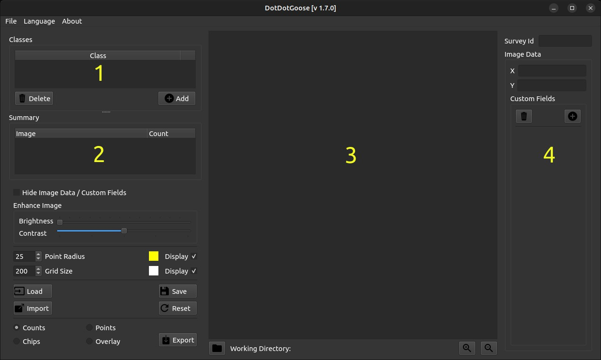
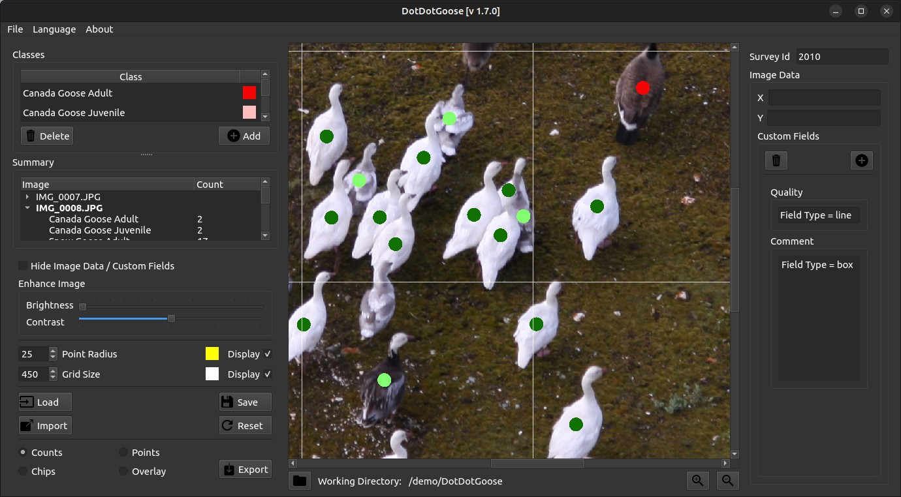

*Release 1.7.0*

**Peter Ersts**

## Contents

- [User Interface](#user-interface)
- [Preparing Data](#preparing-data)
- [Image Formats](#image-formats)
- [Collecting Points](#collecting-points)
  - [Tips and Notes](#tips-and-notes)
- [Editing Points and Classes](#editing-points-and-classes)
  - [Deleting Points](#deleting-points)
  - [Relabeling Points](#relabeling-points)
  - [Rename Class](#rename-class)
  - [Merging Classes](#merging-classes)
  - [Undo \& Redo](#undo--redo)
- [Adding Custom Fields](#adding-custom-fields)
  - [Adding a Custom Field](#adding-a-custom-field)
  - [Deleting Custom Fields](#deleting-custom-fields)
- [Saving and Loading Point Data](#saving-and-loading-point-data)
  - [Saving Point Data](#saving-point-data)
  - [Quick Save](#quick-save)
      - [Windows \& Linux](#windows--linux)
      - [OSX](#osx)
  - [Loading Point Data](#loading-point-data)
- [Exporting Count Data](#exporting-count-data)
  - [Counts](#counts)
  - [Points](#points)
  - [Chips](#chips)
  - [Overlay](#overlay)
- [Schema](#schema)
- [Acknowledgments](#acknowledgments)

#### Jan 03, 2024

<br />

DotDotGoose is a free, open source tool to assist with manually
counting objects in images. DotDotGoose was purpose- built since most
conservation researchers and practitioners working on counting objects
in images were using software such as Adobe Photoshop and ImageJ which
are not ideally suited for many conservation applications.

The DotDotGoose interface makes it easy to create and edit classes of
objects to be counted and you can pan and zoom to accurately place
points to identify individual objects. Information about objects can
be stored in custom fields and this metadata can be exported for use
in spreadsheet or statistics software.

Point data collected with DotDotGoose will be very valuable training
and validation data for any future efforts with computer assisted
counting.

Website:
<https://biodiversityinformatics.amnh.org/open_source/dotdotgoose>
Source: <https://github.com/persts/DotDotGoose>

If you use this application on data that results in a publication,
report, or online analysis, we ask that you include the following
reference:

Ersts,P.J.\[Internet\] DotDotGoose (version 1.7.0). American Museum of
Natural History, Center for Biodiversity and Conservation. Available
from
<http://biodiversityinformatics.amnh.org/open_source/dotdotgoose>.

##### License

For licensing information and usage rights, please see the [LICENSE](./LICENSE).

# User Interface

The user interface has four main components.

**Class Editor \[1\]** This component allows you to add and delete
“classes” for your survey.

**Point Summary \[2\]** This component will display the images you
have annotated and a summary of points counts by class. Double
clicking on an image name in the summary window will automatically
load that image and display the associated points and image data.

**Image Display \[3\]** This component will display your current image
and the points associated with that image.

**Image Data \[4\]** This component allows you to store x and y
coordinates (e.g. UTM coordinates or Latitude Longitude coordinates)
and add custom fields for storing additional information (e.g.,
comments) that are specific to each image in your survey.

| &nbsp; |
|---|
| <a id="fig1"></a> |
| **Fig. 1**: DotDotGoose user interface. |

# Preparing Data

DotDotGoose was designed to work on a single directory of images at a
time, which is a typical way of storing data from surveys or data
collection events.

| &nbsp; |
|---|
| <a id="fig2"></a> |
| **Fig. 2**: Simple folder structure expected by DotDotGoose. |

DotDotGoose does not save the full image path in the project (`pnt`)
file enabling you to easily move data around on your hard drive. As a
result, you must save the project file in the same directory as your
images. Furthermore, DotDotGoose will display an error message if you
attempt to load images that are outside of the current working
directory.

The working directory is automatically set when you,

1. Load an existing project file, or

2. Drag the first image(s) into the Image Display component, or

3. Drag a folder of images into the Image Display component, or

4. Click the folder icon to load a folder of images.

> [!TIP]
> For example, if you start a new counting project by dragging in
> `IMG_0007.JPG` \([Fig 2](#fig2)\) **Survey 1** will become the working directory.
> You can also start a new counting project by dragging in the folder
> **Survey 1**. Attempting use an image from any other location other
> than **Survey 1** will result in an error message until your restart
> DotDotGoose or press the reset button.

# Image Formats

DotDotGoose should be able to load most single and three channel image
formats and has been tested on images up to 1.5GB.

> [!NOTE]
> Your computer’s available RAM will be the limiting factor when
> loading very large images

# Collecting Points

To begin collecting points,

1. Drag one or more images or a folder of images from your file browser
    into the Image Display area.
2. Click the \[Add\] button in the Class Editor to add a new class.
3. Click the black box next to the new class name and assign a display
    color for that particular class.
4. Click the class name to make it the ‘active’ class.
5. Zoom into your targets using the mouse wheel or the zoom buttons.
6. Pan around the image with a typical left-click drag motion.
7. When you have centered your unmarked targets, press and hold the
    <kbd>Ctrl</kbd> (Linux & Windows) or <kbd>Command/⌘</kbd> (OSX) key then left-click to place
    a point on your target.

| &nbsp; |
|---|
| <a id="fig3"></a> |
| **Fig. 3**: Example counting project. |

## Tips and Notes

- You can use the up arrow or <kbd>W</kbd> and the down arrow or <kbd>S</kbd> keys on your
  keyboard to cycles through the images loaded in a project.

- You can quickly switch between classes using the number keys. If using
  the key pad name sure <kbd>Num Lock</kbd> is on.

- While panning or zooming you can press the <kbd>d</kbd> key to toggle the
  points on and off.

- You can change the size of the points being displayed by adjusting the
  “Point Radius” value. To change this value, use the up and down arrows
  on the input field.

- You can change the default “active” class color from yellow to a color
  of your choice by clicking on the box next to the “Point Radius” input
  field.

- A grid is overlaid on the image to help focus your attention while
  counting. You can change the size of the grid and color of the grid.

- While panning or zooming you can press the <kbd>g</kbd> key to toggle the grid
  on and off.

- While you can use a track pad with DotDotGoose, it is highly
  recommended that you use a two button mouse with a scroll wheel.

- Point placement can be important for future uses of these count data
  so it is recommended that you carefully and consistently place your
  points.

- If you have several surveys that will have the same classes and custom
  fields, before you start collecting points you can click the
  \[Import\] button and select an existing project file as a template to
  load the classes and any custom fields.

# Editing Points and Classes

## Deleting Points

1. Press and hold the <kbd>Shift</kbd> key then left-click and drag the mouse to
    draw a box around the point(s) you would like to delete.

2. Once you release the mouse button the selected points will be
    highlighted with a red halo.

3. Press the <kbd>Delete</kbd> key to remove the points.

## Relabeling Points

1. Make a class active by clicking its name in the class editor.

2. Press and hold the <kbd>Shift</kbd> key then left-click and drag to draw a box
    around the point(s) you would like to relabel.

3. Once you release the mouse button the selected points will be
    highlighted with a red halo.

4. Press the <kbd>r</kbd> key to relabel the selected points to the active
    class.

## Rename Class

Double click the class name in the class editor and enter a new name.

## Merging Classes

If you originally create two classes and later decide that the two
classes should really have been one class, you can simply rename the
second class to that of the first and they two classes will be merged.

## Undo & Redo

<kbd>Ctrl</kbd>+<kbd>Z</kbd> (<kbd>⌘</kbd>+<kbd>Z</kbd>) and <kbd>Ctrl</kbd>+<kbd>Y</kbd> (<kbd>⌘</kbd>+<kbd>Y</kbd>) will undo and redo point
adding, deleting, and relabeling action.

# Adding Custom Fields

Adding custom fields allow you to store additional image specific data
(e.g., quality or comments) for each image in your survey. Custom
fields allow you to completely work within DotDotGoose rather than
having to have a separate file for database for storing information
and then later merging the count data with the this extra information.

## Adding a Custom Field

1. Click the \[Add Field\] button to open the Add Custom Field dialog.
2. Enter the name for the field.
3. Select line or box from the pulldown to determine the type of field.

    - **line** - a single line field that is useful for numeric values or
      short text.

    - **box** - a text box that allows multi line input such as comments or
      notes.

4. Click the \[Save\] button to add the field.

## Deleting Custom Fields

1. Click the \[Delete Field\] button to open the Delete Custom Field dialog.
2. Select the field you would like to remove from the pull down menu.
3. Click the \[Delete\] button.  
   > [!NOTE]  
   > This will remove the custom
   > field and existing data in it for the active project

# Saving and Loading Point Data

You can save your point data to a file and reload them as needed. If
you want to share the raw point data with another colleagues simply
package / copy the directory containing the project (`pnt`) file and
images. Save frequently!

## Saving Point Data

1. Click the \[Save\] button to open the save file dialog.
2. Enter a new file name or select and existing file to overwrite.  
    > [!NOTE]
    > You must save your project file in the same directory as your images

## Quick Save

#### Windows & Linux

1. <kbd>Ctrl</kbd>+<kbd>S</kbd> will save your point data to the last opened or saved point
    file. If not point file exists, a save file dialog will open.

#### OSX

1. <kbd>⌘</kbd>+<kbd>S</kbd> will save your point data to the last opened or saved
point file. If not point file exists, a save file dialog will open.

## Loading Point Data

1. Click the \[Load\] button to open the file dialog.

2. Select a project file to load.

# Exporting Count Data

Clicking the \[Export\] button will open a file dialog where you will
enter a new file name or select and existing file to overwrite.

There are three export options.

## Counts

This option will export a summary of the counts and all custom fields
in your project. There will be one line per image in your project.

```csv
survey_id, image_name, class_1_counts, class_2_counts, &hellip;
class_n_counts, x, y, custom_field_1, cus- tom_field_2, &hellip;
custom_field_n
```

This CSV file can then be read by your favorite spreadsheet or
statistics software.

## Points

This option will export a line for each point in your project.

```csv
survey_id, image_name, class_name, x, y
```

## Chips

This option will export a chip or subimage centered on each point with
a width and height of your choosing. A directory will be created for
each class in your project. The directory selected for exporting image
chips must be empty.

## Overlay

This option will export what is currently displayed in the Image
Display area, including grid lines and highlighted points.

# Schema

The project (`pnt`) file is a JSON object with an array and five
dictionaries.

```json
{
  "$schema": "http://json-schema.org/draft-07/schema#",
  "type": "object",
  "properties": {
    "classes": {
      "type": "array",
      "items": {
        "type": "string"
      }
    },
    "points": {
      "type": "object",
      "additionalProperties": {
        "type": "object",
        "additionalProperties": {
          "type": "array",
          "items": {
            "$ref": "#/definitions/point"
          }
        }
      }
    },
    "colors": {
      "type": "object",
      "additionalProperties": {
        "type": "array",
        "items": {
          "type": "integer"
        },
        "minItems": 3,
        "maxItems": 3
      }
    },
    "metadata": {
      "type": "object",
      "properties": {
        "survey_id": {
          "type": "string"
        },
        "coordinates": {
          "type": "object",
          "additionalProperties": {
            "type": "object",
            "properties": {
              "x": {
                "type": "string"
              },
              "y": {
                "type": "string"
              }
            },
            "required": ["x", "y"]
          }
        }
      },
      "required": ["survey_id", "coordinates"]
    },
    "custom_fields": {
      "type": "object",
      "properties": {
        "fields": {
          "type": "array",
          "items": {
            "$ref": "#/definitions/field_def"
          }
        },
        "data": {
          "type": "object",
          "additionalProperties": {
            "type": "object",
            "additionalProperties": {
              "type": "string"
            }
          }
        }
      },
      "required": ["fields", "data"]
    },
    "ui": {
      "type": "object",
      "properties": {
        "grid": {
          "type": "object",
          "properties": {
            "size": {
              "type": "integer"
            },
            "color": {
              "type": "array",
              "items": {
                "type": "integer"
              },
              "minItems": 3,
              "maxItems": 3
            }
          },
          "required": ["size", "color"]
        },
        "point": {
          "type": "object",
          "properties": {
            "radius": {
              "type": "integer"
            },
            "color": {
              "type": "array",
              "items": {
                "type": "integer"
              },
              "minItems": 3,
              "maxItems": 3
            }
          },
          "required": ["radius", "color"]
        }
      },
      "required": ["grid", "point"]
    }
  },
  "required": ["classes", "points", "colors", "metadata", "custom_fields", "ui"],
  "definitions": {
    "point": {
      "type": "object",
      "properties": {
        "x": {
          "type": "number"
        },
        "y": {
          "type": "number"
        }
      },
      "required": ["x", "y"]
    },
    "field_def": {
      "type": "array",
      "items": {
        "type": "string"
      },
      "minItems": 2,
      "maxItems": 2
    }
  }
}
```

# Acknowledgments

I would like to thank the following people for beta testing and the
feedback they have provided:

- Rochelle Thomas and RF Rockwell from the [Hudson Bay
  Project](http://research.amnh.org/~rfr/hbp/)

- Ned Horning, [Center for Biodiversity and
  Conservation](https://www.amnh.org/research/center-for-biodiversity-conservation),
  American Museum of Natural History

- Felicity Arengo, [Center for Biodiversity and
  Conservation](https://www.amnh.org/research/center-for-biodiversity-conservation),
  American Museum of Natural History

- Heather Lynch, [Lynch Lab for Quantitative
  Ecology](https://lynchlab.com/), Stony Brook University

- [Jarrod Hodgson](http://www.jarrodhodgson.com.au/) , University of
  Adelaide

- Emily Kelsey, [Western Ecological Research
  Center](https://www.usgs.gov/centers/werc), U.S. Geological Survey

- Louise Wilson, [Leigh Marine
  Laboratory](https://www.auckland.ac.nz/en/science/about-the-faculty/university-reserves/leigh-marine-laboratory.html),
  The University of Auckland

- Kalinka Rexer-Huber, [Parker
  Conservation](https://www.parkerconservation.co.nz/)

- Richard Casalina Jr., [Values-in-Action
  Foundation](http://www.viafdn.org/)

- Peter Frost, Freelancer, New Zealand

- Ido Senesh \[ code contributor \],
  [Bumblebee](https://pollination.ai/)

- Stephanie Braswell, Auburn University

- Khem So, U.S. Fish and Wildlife Service

- Rebecca Scully, U.s. Fish and Wildlife Service

The image used in this documentation is courtesy of the Hudson Bay
Project
