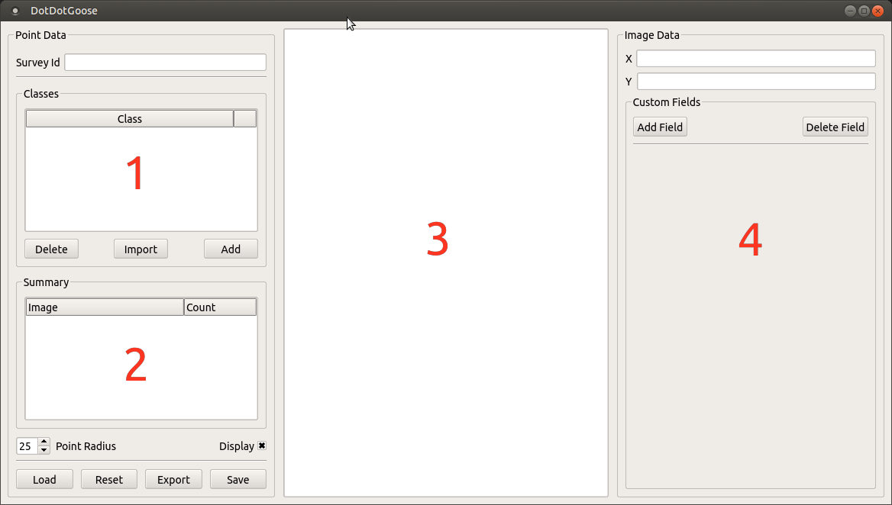

If you use this application on data that results in a publication, report, or online analysis, we ask that you include the following reference:

Ersts,P.J.[Internet] DotDotGoose (version 1.0.0). American Museum of Natural History, Center for Biodiversity and Conservation. Available from http://biodiversityinformatics.amnh.org/open_source/dotdotgoose. Accessed on [DOWNLOAD DATE].

.. raw:: latex

    \newpage

.. image:: amnh-cbc-template_small.png

DotDotGoose is a free, open source tool to assist with manually counting objects in images. DotDotGoose was purpose-built since 
most conservation researchers and practitioners working on counting objects in images were using software such as Adobe Photoshop and ImageJ 
which are not ideally suited for many conservation applications. 

The DotDotGoose interface makes it easy to create and edit classes of objects 
to be counted and you can pan and zoom to accurately place points to identify individual objects. Information about objects can be stored in 
custom fields and this metadata can be exported for use in spreadsheet or statistics software.

Point data collected with DotDotGoose will be very valuable validation data for any future efforts with computer assisted counting.

| Website: https://biodiversityinformatics.amnh.org/open_source/dotdotgoose
|
| Source: https://github.com/persts/DotDotGoose

.. raw:: latex

    \section*{License}

DotDotGoose is free software: you can redistribute it and/or modify
it under the terms of the GNU General Public License as published by
the Free Software Foundation, either version 3 of the License, or
(at your option) any later version.

DotDotGoose is distributed in the hope that it will be useful,
but WITHOUT ANY WARRANTY; without even the implied warranty of
MERCHANTABILITY or FITNESS FOR A PARTICULAR PURPOSE.  See the
GNU General Public License for more details.

You should have received a copy of the GNU General Public License
along with with this software.  If not, see http://www.gnu.org/licenses/.

.. raw:: latex

    \newpage

User Interface
==============
The user interface has four main components.

Class Editor [1]
    This component allows you to add and delete "classes" for your survey and also import classes and custom fields from existing point files.

Point Summary [2]
    This component will display the images you have annotated and a summary of points counts by class. Double clicking on an image name in the summary window will automatically load that image and display the associated points and image data.

Image Display [3]
    This component will display your current image and the points associated with that image.

Image Data [4]
    This component allows you to store x and y coordinates (e.g. UTM coordinates or Latitude Longitude coordinates)and add custom fields for storing additional information (e.g., comments) that are specific to each image in your survey.

|
|

    DotDotGoose user interface.

.. raw:: latex

    \newpage

Preparing Data
==============
DotDotGoose was designed to work on a single directory of images at a time, which is a typical way of storing data from surveys or data collection events.

.. figure:: folder_structure.png

    Simple folder structure expected by DotDotGoose.

DotDotGoose does not save the full image path in the pnt file enabling you to easily move data around on your hard drive. 
As a result, you must save the pnt file in the same directory as your images.
Furthermore, DotDotGoose will display an error message if you attempt to load images that are outside of the current working directory.

The working directory is automatically set when you,

    1. Load an existing point file, or
    2. Drag the first image file into the Image Display component.

For example, if you start a new counting project by dragging in IMG_0007.JPG (Fig 2) **Survey 1** will become the working directory. 
Attempting use an image from any other location other than **Survey 1** will result in an error message until your restart DotDotGoose or press the reset button.

Image Formats
=============

DotDotGoose should be able to load most single and three channel image formats and has been tested on images up to 1.5GB. 

*Note: Your computer's available RAM will be the limiting factor when loading very large images*

Collecting Points
=================
To begin collecting points,

    1. Drag an image from your file browser into the Image Display area.
    2. Click the [Add] button in the Class Editor to add a new class.
    3. Click the black box next to the new class name and assign a display color for that particular class.
    4. Click the class name to make it the 'active' class.
    5. Zoom into your targets using the mouse wheel.
    6. Pan around the image with a typical left-click drag motion.
    7. When you have centered your unmarked targets, press and hold the Ctrl (Linux & Windows) or Command (OSX) key then left-click to place a point over your target.

.. figure:: example.png

    Example counting project.

.. raw:: latex

    \section*{Tips and Notes}

* Points belonging to the active class will always display as yellow in the image display area, so it is best practice to not use yellow as a color for a class
* While you can use a track pad with DotDotGoose, it is highly recommended that you use a two button mouse with a scroll wheel.
* Point placement can be important for future uses of these count data so it is recommended that you carefully place your point so it represents the 'centroid' of the target you are counting.
* If you have several surveys that will have the same classes and custom fields, before you start collecting points you can click the [Import] button and select an existing point file as a template to load the classes and any custom fields.

Editing Points and Classes
==========================

Deleting Points
---------------
    1. Press and hold the Shift key then left-click and drag the mouse to draw a box around the point(s) you would like to delete.
    2. Once you release the mouse button the selected points will be highlighted with a red halo.
    3. Press the Delete key to remove the points.

Relabeling Points
-----------------
    1. Make a class active by clicking its name in the class editor.
    2. Press and hold the Shift key then left-click and drag to draw a box around the point(s) you would like to relabel.
    3. Once you release the mouse button the selected points will be highlighted with a red halo.
    4. Press the 'r' key to relabel the selected points to the active class.

Rename Class
------------
Double click the class name in the class editor and enter a new name.

Merging Classes
---------------
If you originally create two classes and later decide that the two classes should really have been one class, you can simply rename the second class to that of the first and they two classes will be merged.

Adding Custom Fields
====================
Adding custom fields allow you to store additional image specific data (e.g., quality or comments) for each image in your survey. Custom fields allow you to completely work within DotDotGoose rather than having to have a separate file for database for storing information and then later merging the count data with the this extra information. 

Adding a Custom Field
---------------------
    1. Click the [Add Field] button to open the Add Custom Field dialog.
    2. Enter the name for the field.
    3. Select line or box from the pulldown to determine the type of field.

        * line - a single line field that is useful for numeric values or short text.
        * box - a text box that allows multi line input such as comments or notes.

    4. Click the [Save] button to add the field.

Deleting Custom Fields
----------------------
    1. Click the [Delete Field] button to open the Delete Custom Field dialog.
    2. Select the field you would like to remove from the pull down menu.
    3. Click the [Delete] button. *Note: This will remove the custom field and existing data in it for the active project*

Exporting Count Data
====================
Clicking the [Export] button will open a file dialog where you will select an existing or define a new CSV file to holed the exported data. The export format will be:

    *survey_id, image_name, class_1_counts, class_2_counts, ... class_n_counts, x, y, custom_field_1, custom_field_2, ... custom_field_n*

This CSV file can then be read by your favorite spreadsheet or statistics software.

.. raw:: latex

    \newpage

Schema
======

The pnt file is a JSON object with an array and four dictionaries. 

.. code-block:: python

    {
        "classes": [str],
        "points": {
            "image_name": {
                "class_name": [point]
            }
        },
        "colors": {
            "class_name": [ int, int, int]
        },
        "metadata": {
            "survey_id": str,
            "coordinates": {
                "image_name": {
                    "x": str, # String to allow any coordinate format
                    "y": str  
                }
            }
        },
        "custom_fields": {
            "fields": [field_def],
            "data": {
                "filed_name": {
                    "image_name": str
                }
            }
        }
    }

    point: {
        "x": float, # pixel coordiantes
        "y": float  # pixel coordinates
    }

    field_def: [ str, str]

.. raw:: latex

    \newpage
    \section*{Acknowledgments}

I would like to thank the following people for beta testing and the feedback they have provided:

    * Rochelle Thomas and RF Rockwell from the Hudson Bay Project
    * Ned Horning, Center for Biodiversity and Conservation, American Museum of Natural History
    * Felicity Arengo, Center for Biodiversity and Conservation, American Museum of Natural History
    * Heather Lynch, `Lynch Lab for Quantitative Ecology <https://lynchlab.com/>`_, Stony Brook University

The image used in this documentation is courtesy of the Hudson Bay Project 